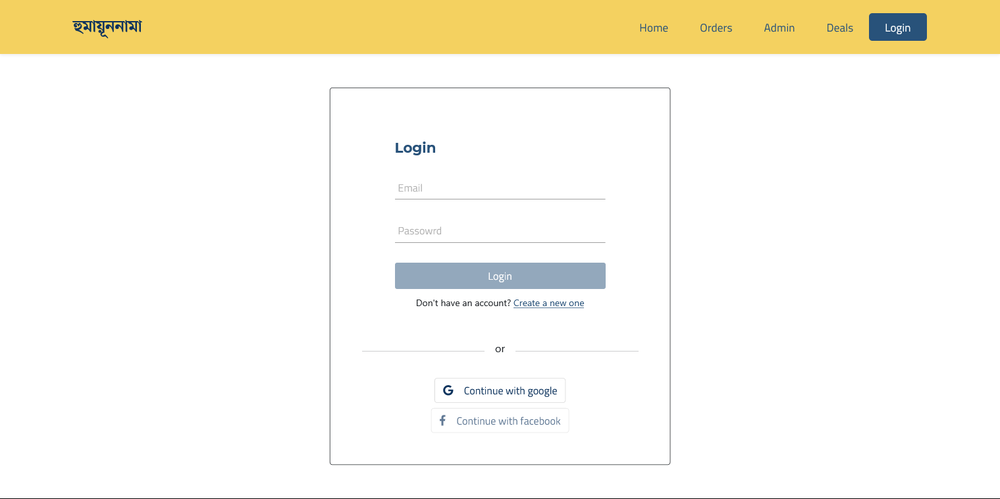
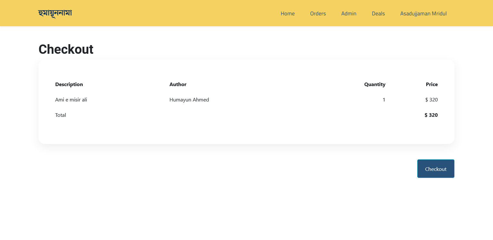

# Humayunnama - Server

Get your favourite books of Humayun Ahmed today!

## Overview
This is mainly a mockup website for online book store based on books written by [Humayun Ahmed](https://en.wikipedia.org/wiki/Humayun_Ahmed). We have used [Firebase Auth](https://firebase.google.com/docs/auth) for authenticate user and [MongoDB](https://www.mongodb.com/) for storing the database for this project.

User can select any book for checkout. But before that user have to have an account on this website. However you can login with your google account. Then user will be redirect to chcekout page, where he can order or discard the process. In order page, user can see every order placed by him sequentially. There is an option for deals in the navigation bar. We're still working on that.

There is also an admin panel for managing inventory and adding new books to the database. Although we didn't actually filtered user to check whether his role is admin or not, rather anyone can access the inventory by this web application. This was only for development purpose. You can definitely check it out!

### Technology Used
• MERN Stack  
 
• Firebase Auth  
• Firebase Hosting  
 
• React Router  
• React Hook Form  
• Private Route  
• Bootstrap

## [Live Site](https://humayun-nama.firebaseapp.com/)
## [Client Side](https://github.com/AsadujjamanMridul/humayunnama-client/)

### Screenshots
#### Landing Page

 
#### Login Page

 
#### Checkout Page

#### Orders Dashboard

###### `Thank you`

